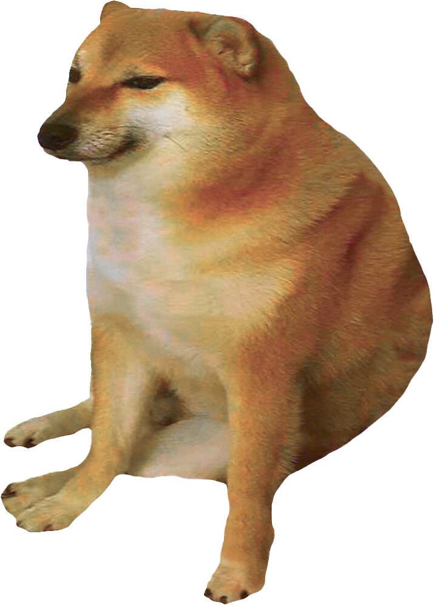
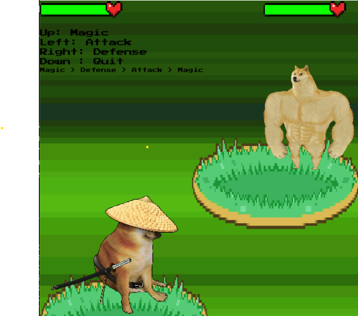
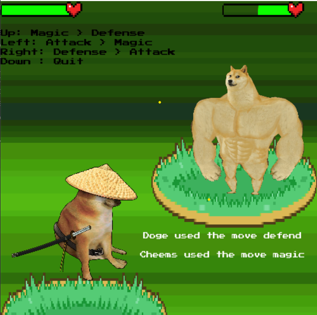
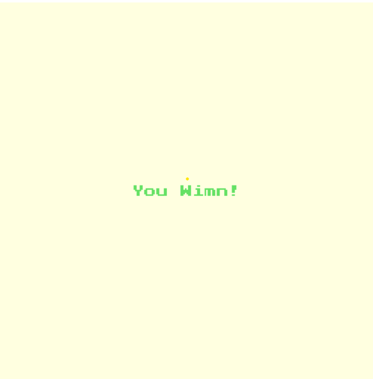
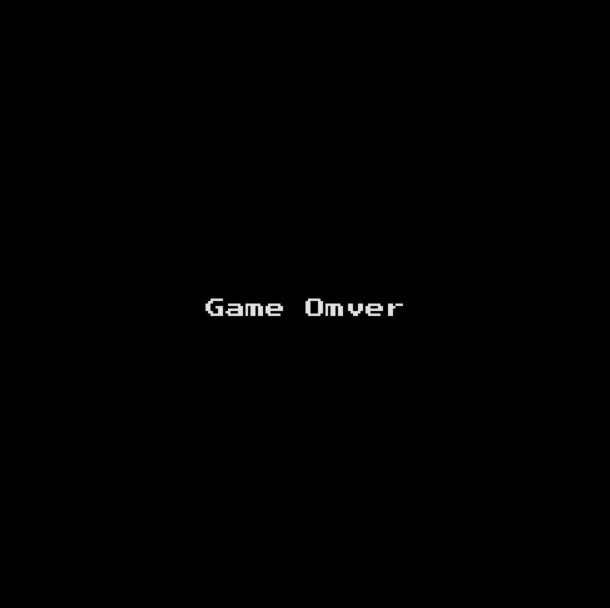

### Hemlo!

Our Cheems game is a motion-tracking pokemon-esque game, in which you work to defeat the evil Doge by choosing the correct attacks. We also have a [presentation](https://docs.google.com/presentation/d/1lNk26ucEzlNNYH7JhVi08h3mKRhAKvT26UwK4x0fnDA/edit?usp=sharing) walking through our goals and our game.

### Our Goals

There were a few specific goals that each team member had in mind when starting ideation for this project:

* Shamama: gain experience using OpenCV and working with motion tracking
* Jack: incorporate music into the game
* Jaclyn: create a fun and challenging game that can be played repeatedly

This game is able to fulfill all of our respective goals, by allowing us to create an interactive game that incorporates hand motion and invigorating sound design.

## Game Overview

### Game Demo
<iframe width="560" height="315" src="https://www.youtube.com/embed/VT9-Dtifpqw" title="YouTube video player" frameborder="0" allow="accelerometer; autoplay; clipboard-write; encrypted-media; gyroscope; picture-in-picture" allowfullscreen></iframe>

 

### Playable Character

In this game, you control Cheems, who has three moves: attack, defend, or magic. Depending on the direction that you sweep your hand, Cheems will do a certain action.

### Backgrounds

We used a retro 8-bit font to have our game pixel-art and typography match with our desired aesthetic.

We wanted our game to resemble Pokemon, with the controllable character towards the front and the enemy towards the rear.

The characters move in the direction that their action corresponds with.

We wanted to make the win screen bright and exciting, to celebrate your win!

The game over screen is a generic game over screen, reminicient of retro games.

### Sound Effects

We have a backing track throughout your battle, which is from Pokemon. The backing track we picked is from Pokemon Ruby Sapphire, from the battle against champion Steven.

When you win, we play a upbeat tune which is the sound that plays in Pokemon when Professor Oak evaluates your PokeDex.

When you lose, there are two sound effects that you might hear. Most of the time, you will hear a sad violin track playing, but there is a 3 in 10 chance that you will hear an Among Us jingle.

## Installation

Our [installation instructions](https://github.com/olincollege/cheems-game#installation-and-setup) are listed on our [GitHub repository](https://github.com/olincollege/cheems-game), where you can download all the files needed to play the game. To run the game, navigate to the terminal and run the following command: 

`$ python run_game.py`

### About Us

    

    

Shamama Sirroon is a sophomore studying Electrical and Computer Engineering at Olin College. She is commonly misidentified as a garden gnome and is a great team player. Shamama spends her free time working on Olin Electric Motorsports, bothering people and being a ratty presence.

    

    

Jaclyn Ho is a sophomore studying Engineering with Computing at Olin College. She loves Riot (especially League and Valorant), and she is an adept problem solver and a determined worker. Jaclyn spends her free time playing video games, making cat noises, and eating ramen.
    

    

    

Jack Levitsky is a sophomore studying Robotics Engineering at Olin College. He is very tall and laughs loudly. Jack's laughter is contagious and he loves working with people collaboratively. In his free time, Jack pursues robotics research, makes fun of short people, and flexes his height.
    
## References
We used the [MediaPipe API](https://google.github.io/mediapipe/) for our hand tracking: https://google.github.io/mediapipe/.

To implement our view module, we used [Pillow](https://pillow.readthedocs.io/en/stable/) for image processing.

We used an [online font](https://www.fontspace.com/press-start-2p-font-f11591) to create our 8-bit typography.

For our visuals, we used the following references:

* [Health Bar](https://www.kindpng.com/imgv/owbTmm_health-bar-png-game-health-bar-png-transparent/)
* [Pokemon Background](https://www.pokecommunity.com/showthread.php?t=302401)
* [Stronk Doge](https://steamcommunity.com/app/1383720)
* [Cheems](https://www.reddit.com/r/dogelore/comments/e76g65/revisited_full_body_cheems_png_color_corrected/)

For our music, we used [Pokemon battle music](https://www.youtube.com/watch?v=LaAGsbtETIg&t=76s&ab_channel=Pokeli) that we used a [YouTube to mp3](https://getx.topsandtees.space/EpA8Aen4kK) converter to convert to a usable mp3 file. For our winning and losing sound effects, the sounds can be found at the following links:

* [Winning](https://www.youtube.com/watch?v=Ad204YupWhc&ab_channel=RCMS)
* [Losing](https://www.myinstants.com/instant/sad-violin-the-meme-one/)
* [Losing Easter Egg](https://www.youtube.com/watch?v=ekL881PJMjI&ab_channel=GamingSoundFX)

